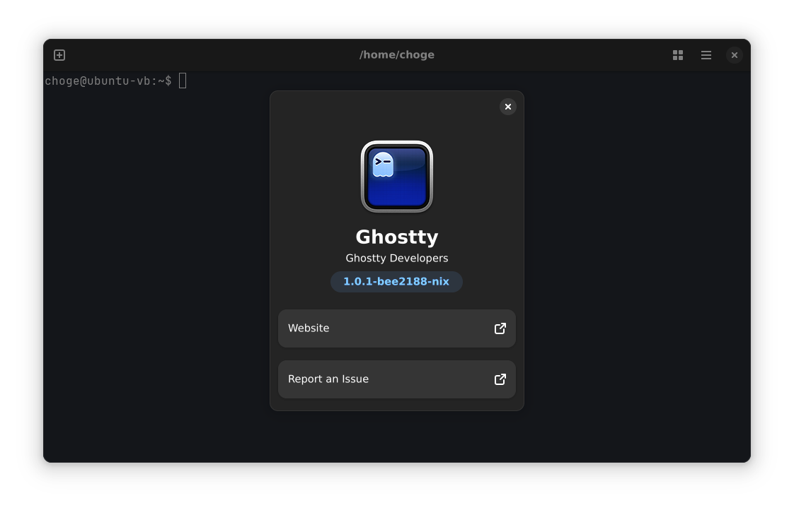
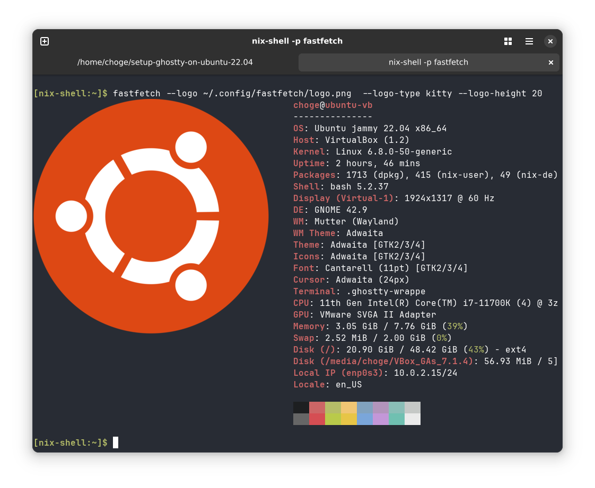

Set up Ghostty on Ubuntu 22.04
==============================

What is this?
-------------

This repository demonstrates how to install [Ghostty](https://ghostty.org/) on
Ubuntu 22.04 LTS using [Nix](https://nixos.org/download/).

As of writing (Dec 28, 2024) no packages for Ghostty are available on Ubuntu,
so you need to build it from source or build it using Nix. I haven't tried
building it from source yet, but I found it's not that hard to install it using
Nix if you know some tweaks required.





Steps to install Ghostty
------------------------

1. Install Nix
2. Add configurations for Nix
3. Install home-manager + ghostty

DONE!

### 1. Install Nix

Visit [the download site](https://nixos.org/download/) and follow the instructions.
I chose the multi-user installation.

You can verify your installation by running something like ...

```bash
$ nix-shell -p hello
#(a bunch of logs to install some dependencies)
[nix-shell:~]$ hello
Hello, world!
```

### 2. Add configurations for Nix

[Flake](https://nixos.wiki/wiki/Flakes) is an experimental (but widely accepted)
feature of Nix, which manages inputs and outputs of your Nix configurations,
like `go.mod` and `go.sum` in Golang.

Ghostty provides the flake file (and not available in home-manager's default registry),
so you'll need to enable it.

According to [Wiki](https://nix-community.github.io/home-manager), you can put
the following line in `~/.config/nix/nix.conf`.

```
experimental-features = nix-command flakes
```

> [!Note]
> Maybe I can manage this configuration file with home-manager...?

### 3. Install home-manager _and_ ghostty

[Home-manager](https://github.com/nix-community/home-manager) is a tool for 
managing your home directory and user-installed applications.

With the following command, you can enable home-manager with flake.

```bash
$ cd path/to/this/repo
$ nix-shell -p home-manager
[nix-shell:path/to/this/repo]$ home-manager switch --flake 'nix#ubuntu'
```

With this command, it installs home-manager and ghostty as well.

